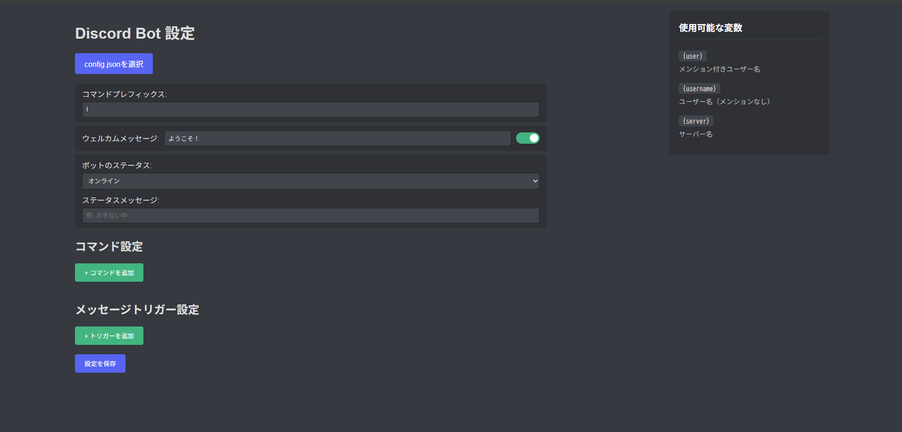

# Discord Bot GUI設定ツール 🎮

[](https://www.python.org/downloads/)
[](LICENSE)
[](https://discordpy.readthedocs.io/)

Discordボットの設定をGUIで簡単に行えるツールです。コマンドやメッセージトリガーの設定、ウェルカムメッセージのカスタマイズなどが可能です。

## ✨ 特徴

- 🎯 直感的なGUIインターフェース
- 🔄 リアルタイム設定プレビュー
- 🎨 Discordのダークテーマに合わせたデザイン
- 📋 クリップボードへのワンクリック設定コピー
- 🔧 柔軟なコマンドとトリガー設定
- 👋 カスタマイズ可能なウェルカムメッセージ
- 🎭 ボットのステータスとアクティビティ設定

## スクリーンショット


*設定画面のスクリーンショット*

## 🚀 機能

### コマンド管理
- コマンドの追加・編集・削除
- 複数行の応答メッセージ
- 変数を使用した動的な応答

### メッセージトリガー
- 部分一致/完全一致の設定
- 複数のトリガー設定
- カスタマイズ可能な応答

### ウェルカムメッセージ
- 新規メンバー参加時の自動メッセージ
- 変数を使用したパーソナライズ
- 有効/無効の切り替え

### ボット設定
- ステータス設定（オンライン/退席中/取り込み中/非表示）
- カスタムステータスメッセージ
- コマンドプレフィックスの変更

## 🛠️ 必要な環境

- Python 3.8以上

## 📥 セットアップ

1. リポジトリをクローン
```bash
git clone [リポジトリURL]
cd [リポジトリ名]
```

2. `.env`ファイルを作成し、Discordボットのトークンを設定
```
DISCORD_TOKEN=あなたのボットトークン
```

3. `config.json`を設定
- `settings.html`をブラウザで開き、設定を行います
- 設定を保存すると、クリップボードにJSONがコピーされます
- コピーしたJSONを`config.json`に貼り付けます

4. ボットを起動
```bash
python main.py
```
※初回起動時に必要なパッケージ（discord.py, python-dotenv）が自動的にインストールされます

## ⚙️ 設定項目

### 基本設定
- プレフィックス: コマンドの先頭に付ける文字（デフォルト: !）
- ウェルカムメッセージ: 新規メンバー参加時のメッセージ
- ボットステータス: オンライン/退席中/取り込み中/非表示
- ステータスメッセージ: ボットのステータスに表示するメッセージ

### コマンド設定
- コマンド名: 実行するコマンド名
- 応答メッセージ: コマンド実行時の応答メッセージ

### メッセージトリガー設定
- トリガーテキスト: 反応するメッセージ
- 応答メッセージ: トリガー時の応答メッセージ
- マッチタイプ: 部分一致/完全一致

## 🔤 使用可能な変数

- `{user}`: メンション付きユーザー名
- `{username}`: ユーザー名（メンションなし）
- `{server}`: サーバー名

## 💡 使用例

### ウェルカムメッセージの例
```
{user} ようこそ！{server}へ！
```

### コマンドの例
```
!hello → こんにちは、{username}さん！
```

### トリガーの例
```
「おはよう」を含むメッセージ → おはようございます、{username}さん！
```

## ⚠️ 注意事項

- トークンは必ず`.env`ファイルで管理し、GitHubなどにアップロードしないでください
- 設定変更後は`config.json`を更新し、ボットを再起動する必要があります

## 🤝 貢献

1. このリポジトリをフォーク
2. 新しいブランチを作成 (`git checkout -b feature/amazing-feature`)
3. 変更をコミット (`git commit -m 'Add some amazing feature'`)
4. ブランチにプッシュ (`git push origin feature/amazing-feature`)
5. プルリクエストを作成

## 📝 ライセンス

GNU General Public License v3.0 - 詳細は [LICENSE](LICENSE) ファイルを参照してください。

このソフトウェアは自由ソフトウェアです。あなたは、Free Software Foundationが発行するGNU General Public Licenseのバージョン3、または（あなたの選択により）それ以降のバージョンのいずれかの条件の下で、このソフトウェアを再配布または変更することができます。

このソフトウェアは有用であることを願って配布されていますが、**いかなる保証もありません**。商品性や特定目的への適合性の保証を含め、明示的または黙示的な保証は一切ありません。詳細はGNU General Public Licenseを参照してください。

## 🙏 謝辞

- [discord.py](https://discordpy.readthedocs.io/) - Discord APIのPythonラッパー
- [python-dotenv](https://github.com/theskumar/python-dotenv) - 環境変数の管理 